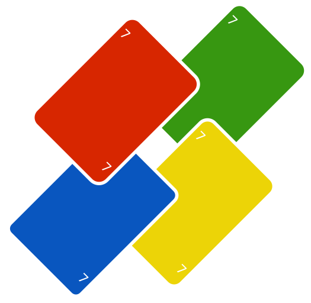
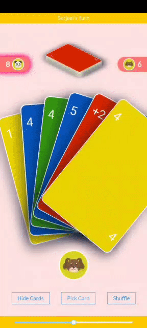

<!-- PROJECT LOGO -->
 

    

  <h3 align="center">Online Multiplayer Cards Game 🃏</h3>
  
  

    Don't have UNO cards deck? 😟 No problem I got your back 😄. 
  

    
  

    No Sign In/Up needed. Directly come and play with upto 10 of your friends on your phones 😍.
  

<!-- ABOUT THE PROJECT -->

## About The Project

This is a online multiplayer game built to play with same rules as UNO classic. Check the documents for full details

 
    

<h3 align="center">Built With</h3>

 
    
    
    
    
    
    

<h3 align="center">Deployed With</h3>

